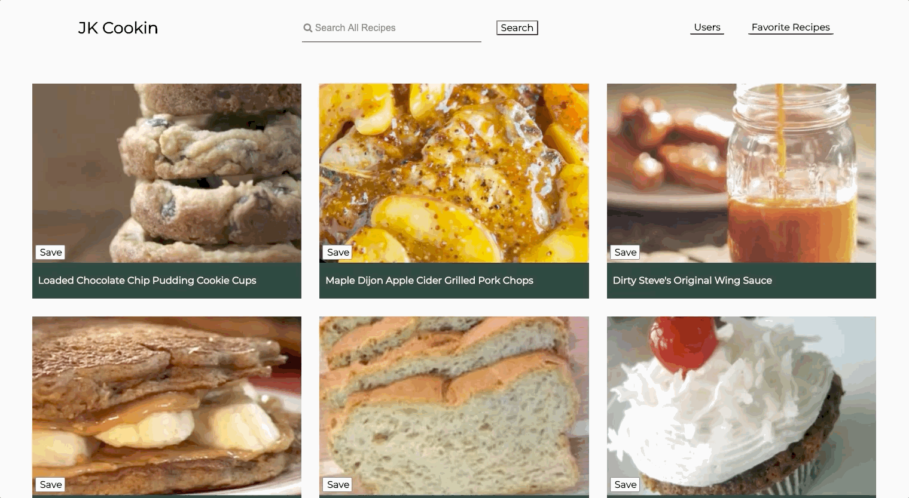

# What's Cookin'?
Kyle Jones & Jake West, FE 2005

The details of this project are outlined in the <a href="https://frontend.turing.io/projects/whats-cookin.html" target="\__blank">project spec</a>.

## Description
JK What’s Cookin is a website that can generate a random user and recipes from a pre-existing database. Users can save recipes that they enjoy and search for recipes by name and type. Users can click on a recipe to see the required ingredients and instructions on how to make a recipe.

This project was a paired-programming project for Turing School of Software and Design’s Front-End-Engineering program in Mod 2 of the 2005 inning. The project utilizes JavaScript, HTML, and CSS files while using git and Github for branching and version control.

## Set Up 

1. Within your group, decide on one person to have the project repository on their Github account. This person will *fork* this repository - on the top right corner of the page, click the fork button. 
2. Both group members should then clone down the forked repository (make sure that everyone is added as a collaborator as well). Since you don't want your project to be named "whats-cookin-starter-kit", add an optional argument after the repo url when cloning. The command should look like this: `git clone [remote-address] [what you want to name the repo]`.
3. Once you have cloned the repo, change into the directory and install the project dependencies. Run npm install to install project dependencies.
4. Run open src/index.html in the terminal to see the HTML page (you should see some boilerplate HTML displayed on the page)
5. Make sure both members of your team are collaborators on the forked repo.

## Functionality
1. On the home view, the user has access to a number of different recipes. When they click on a recipe name, a drop down opens showing the user the recipes ingredients and instructions.

2. Users can favorite ingredients by hitting the save button. If the user hits the save button a second time, the ingredient is removed from their favorite recipes list. On the favorites page, a user can click on any recipe to see the required ingredients & it's instructions.

3. Users can search for recipes by name or by recipe tag (i.e., snack, hors d'oeuvre) and return ingredients that match the search query.

4. Users can also switch into the Users tab, which shows every user & their pantry. Currently, when the page loads, a random user's data is loaded into the site. Future iterations of this project include the ability to view the website from the perspective of a user of your choosing.

## Contributors
This project represents the joint efforts of Kyle Jones and Jake West.
* Kyle Jones Github: https://github.com/KJJones13
* Jake West Github: https://github.com/jkwest-93
